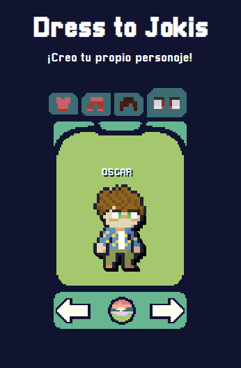

# 🎨 Dress to Jokis

**Dress to Jokis** es una aplicación web interactiva donde puedes crear tu propio personaje estilo pixel art, conocido como un "Joki". Todos los personajes representan a estudiantes del segundo año 2025 de UniNorte - Sede Caacupé.



https://distardev.github.io/dress-to-jokis/

## ✨ Características

- Personaliza a tu personaje "Joki":
  • Remeras
  • Pantalones
  • Cabello
  • Ojos
- Cambia el fondo de la escena.
- Escribe tu nombre en el personaje.
- Diseño responsivo.
- Estilo visual retro en pixel art.

## 🚀 Cómo usar

1. Clona el repositorio:
   ```bash
   git clone https://github.com/tu-usuario/dress-to-jokis.git
2. Abre index.html en tu navegador web.

🛠️ Tecnologías usadas
-  HTML5.
-  CSS3.
-  JavaScript.

📌 Próximas actualizaciones
- Exportar personajes como imagen.
- Más opciones de personalización.
- Integración con una galería de personajes creados.
- Música o sonidos retro.


## 📚 Créditos

Proyecto desarrollado por Osc★r Estela, estudiante del segundo año 2025 de UniNorte, sede Caacupé.
